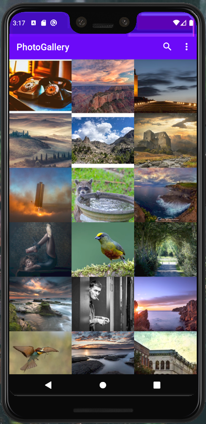
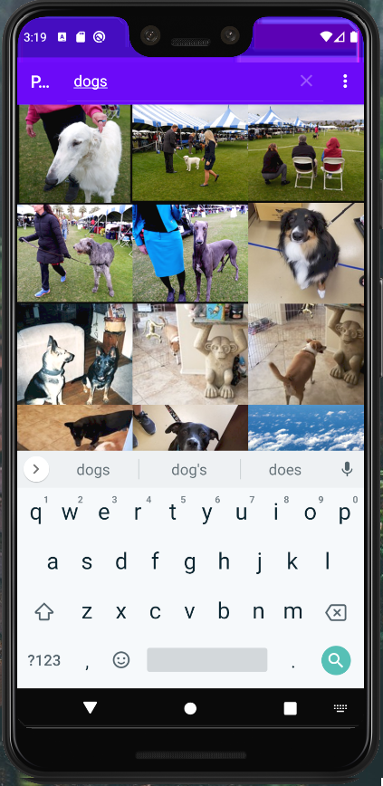

# PhotoGallery
Simple app for fetching and searching photos from Flickr

App built with MVVM architecture.
Networking done with Retrofit2 and RxJava3, Jackson/Gson used for Serialization, Glide used for image loading.
Pagination done with android Paging library

